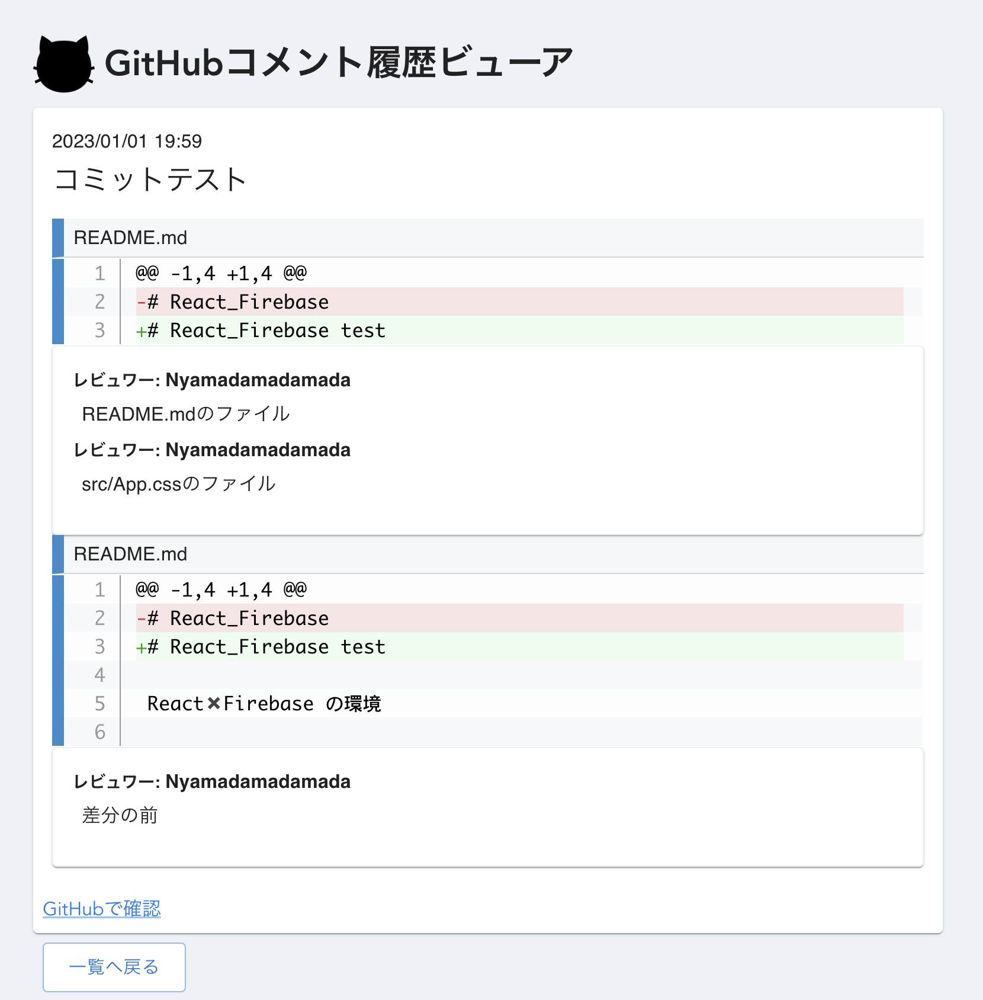

# GitHubコメント履歴ビューア(鋭意作成中...)


GitHubコメント履歴ビューアは、GitHubリポジトリの過去のコメントを一度に確認できる便利なツールです。  
このツールを使用すると、プロジェクトの過去の議論やフィードバックを追跡しやすくなります。

## 機能

- **過去のコメント一覧をJSONファイルに出力**:
- **過去のコメントの一覧表示**: JSONファイルからGitHubリポジトリ内の全てのコメントをタイムライン形式で表示します。コメントの作成日時、作成者、コメントが表示されます。



## 使用方法

1. 必要なツールをインストール

```
sh shell/setup.sh
```

2. GitHubのリポジトリのURLを設定する


3. JSONファイルを確認


4. npmでプロジェクトを起動して、コメントを見る
